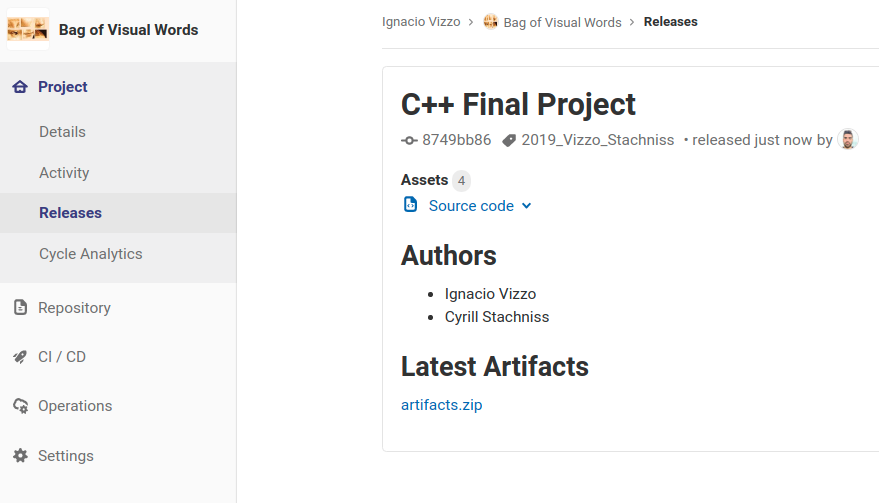

# Make a Release

| Attribute           | Type           | Required                                        | Description                                                            |
| ------------------- | -------------- | ----------------------------------------------- | ---------------------------------------------------------------------- |
| `id`                | integer/string | yes                                             | The ID or URL-encoded path of the project                              |
| `name`              | string         | yes                                             | The release name.                                                      |
| `tag_name`          | string         | yes                                             | The tag where the release will be created from.                        |
| `description`       | string         | yes                                             | The description of the release. You can use .                          |
| `ref`               | string         | no                                              | If `tag_name` doesn't exist, the release will be created from `ref`.\* |
| `assets:links`      | array of hash  | no                                              | An array of assets links.                                              |
| `assets:links:name` | string         | no (if `assets:links` specified, it's required) | The name of the link.                                                  |
| `assets:links:url`  | string         | no (if `assets:links` specified, it's required) | The url of the link.                                                   |

\*It can be a commit SHA, another tag name, or a branch name.

<!-- @import "[TOC]" {cmd="toc" depthFrom=1 depthTo=6 orderedList=false} -->

<!-- code_chunk_output -->

- [Make a Release](#Make-a-Release)
  - [Final Project: Make a Release](#Final-Project-Make-a-Release)
  - [Instructions](#Instructions)
    - [Get used to the Release API](#Get-used-to-the-Release-API)
    - [Modify the template script](#Modify-the-template-script)
      - [upload_artifacts.sh](#uploadartifactssh)
      - [release_data.json](#releasedatajson)
      - [make_release.sh](#makereleasesh)
    - [Make a new release](#Make-a-new-release)

<!-- /code_chunk_output -->

## Final Project: Make a Release

In order to submit your final presentation for the C++ Final project you
**must** make a release in your repository. This way all your code and the build
artifacts(binaries + libraries) will be safely saved in a snapshot of your
repository. You can cleanup your code after the submission, but the release you
make will the one we will consider for the evaluation.

Please be aware that all the changes you make in your releases are being tracked
by GitLab, so if you change the Release after the submissions, we will know.

## Instructions

### Get used to the Release API

First read this two articles

- [Release API](https://gitlab.igg.uni-bonn.de/help/api/releases/index.md)
- [Access Tokens](https://docs.gitlab.com/ce/user/profile/personal_access_tokens.html)

### Modify the template script

You are provided with one script to make a release in your repository BUT first
you need to change some variables

#### upload_artifacts.sh

The build artifacts from the gitlab CI will be usually removed after 1
week(depending on the `.gitlab-ci.yml` configuration file) In order to make sure
that your submission will be safely stored we need to put this artifacts into a
long-term storage place in your project.

There are many ways of doing this. The simplest one in our case would be to
download the latest artifacts from your repository and push this artifacts to a
long-term archive repository. Be aware that this artifacts **can't be** removed
at any point in time by anyone. So please consider if everything is working
before doing this.

1. First make sure your latest pipeline succeed
2. Once you are sure the latest artifacts are the one you want to submit modify
   the `upload_artifacts.sh` and run the script. For this you will need to
   change the `PROJECT_ID` in the script.
3. `./upload_artifacts.sh`
4. After you run the script you will get a response from the server, you need
   this numbers to update the release_data.json properly

Response example:

```json
{
  "alt": "artifacts.zip",
  "url": "/uploads/e550dfc73e150a3e43e6e530ff30212a/artifacts.zip",
  "markdown": "[artifacts.zip](/uploads/e550dfc73e150a3e43e6e530ff30212a/artifacts.zip)"
}
```

We need the **"markdown"** entry for later

After you push your artifacts to the `uploads/` archive is time to save the
location where this artifacts are now

#### release_data.json

This is the data that will be used for making a new release, you should change
the following variables, the rest can remain the same

- `tag_name`: Put the last name of the authors in this tag in the format of
  `2019_NAME_1_NAME_2`
- `description`: Update your names and the markdown entry, please pay attention
  to the example, modify only the names and the hash number that points to your
  artifacts(in my example `e550dfc73e150a3e43e6e530ff30212a`) This will
  guarantee you that you are doing it properly

#### make_release.sh

- `PROJECT_ID`: This is the ID number of your personal project, it can be found
  on the main page of your repository, just search for `Project ID` on your web
  browser
- `IGG_GITLAB_TOKEN`: This is your _personal_ access token to the GitLab API,
  you can replace it on the script file but I recommend it doing it in a
  personal shell. Otherwise your personal access token might end on your
  repository and will be available for other people

### Make a new release

Run the script on your terminal and check that the HTTPS response is correct

```sh
export IGG_GITLAB_TOKEN=RQyayyx92LnqtVk_zm1B # this is your token
./make_release.sh
```

After you made the release you can go to your repository and check that
everything is ok:


Now we can access your source code and binaries at any point in time. Just make
sure this binaries are updated (with the help of the CI) and that everything
runs properly. If your binaries doesn't work the submissions will be discarded.

Make sure there are instructions on your **README.md** on your local repository
